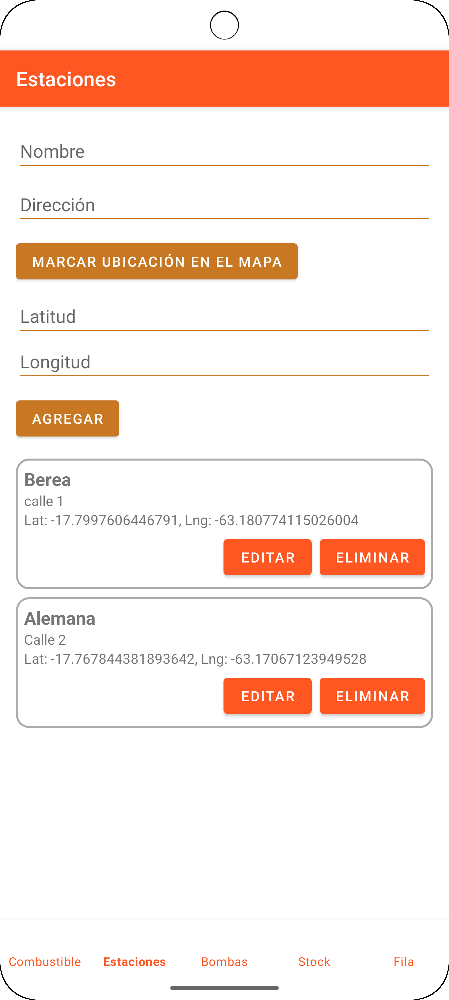
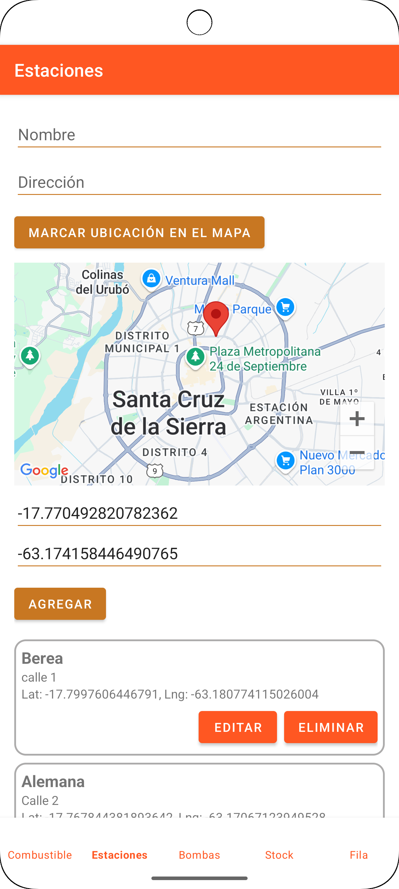

# GasolineraAPP - Parcial de Arquitectura de Software(UAGRM) 
### Arquitectura Tres Capas
> Consejo , la documentacion esta un poco mala asi que proximamente voy a subir lo correcto , lo malo va en los dos ultimos casos de uso.Fijense en el documento que voy a dejar en el repo.
>
> Aplicación Android (Kotlin) que permite administrar *estaciones*, *bombas*, *stock* de combustibles y la *fila de vehículos* mediante una **arquitectura en 3 capas** (Presentación ⇄ Negocio ⇄ Datos). El proyecto corresponde al parcial de la asignatura Arquitectura de Software Avanzada (ASWa).

## Tabla de contenidos

1. [Visión general](#visión-general)
2. [Arquitectura 3 capas](#arquitectura-3-capas)

   1. [Capa de Presentación](#1-capa-de-presentación-ui)
   2. [Capa de Negocio](#2-capa-de-negocio-domain)
   3. [Capa de Datos](#3-capa-de-datos-data)
   4. [Flujo de control entre capas](#flujo-de-control)
3. [Estructura de carpetas](#estructura-de-carpetas)
4. [Modelo de datos y Script SQL](#modelo-de-datos-y-script-sql)
5. [Entidades y casos de uso](#entidades-y-casos-de-uso)
6. [Instalación y ejecución](#instalación-y-ejecución)
7. [Guía para contribuir](#guía-para-contribuir)

---

## Visión general

La app 🌐 **GasolineraV3** ayuda a los usuarios a:

* Ver el *stock* actualizado de cada tipo de combustible en las estaciones registradas.
* Conocer el número estimado de vehículos en la fila y el tiempo de espera.
* Identificar si el combustible disponible alcanza para la fila actual.

Todo el procesamiento se realiza **offline** con una base de datos SQLite embebida, inicializada con datos de ejemplo (ver [Modelo de datos](#modelo-de-datos-y-script-sql)).

<p align="center">
 
  
  
</p>

---

## Arquitectura 3 capas

El proyecto sigue la clásica **arquitectura en tres capas**, cada una con una responsabilidad clara y acoplada de forma mínima:

### 1. Capa de Presentación (UI)

* **Ubicación:** `app/src/main/java/com/example/gasolinerav3/` (excepto `datos/` y `negocio/`).
* **Componentes clave:**

  * `MainActivity.kt` → *host* de `NavController` y `BottomNavigationView`.
  * Fragments generados por el *Navigation Component* (ej.: `fragment_home.xml`, `fragment_bombas.xml`).
  * *ViewBinding* para acceso seguro a vistas.
* **Responsabilidades:**

  * Renderizar datos en listas o tarjetas.
  * Capturar la interacción del usuario (toques, entradas de texto) y redactar peticiones a la capa de negocio.
  * Mostrar *Snackbars* / diálogos con resultados o validaciones.
* **No se permite** lógica de negocio compleja ni acceso directo a SQLite.

### 2. Capa de Negocio (Domain)

* **Ubicación:** `app/src/main/java/com/example/gasolinerav3/negocio/`
* **Clases:** `NBomba`, `NEstacion`, `NFila`, `NStockCombustible`, etc.
* **Responsabilidades:**

  * Orquestar la lógica: validaciones, cálculos y reglas.
  * Aplicar políticas; p. ej. `NFila.calcularEstimacion()` calcula cuántos autos caben en la fila, litros necesarios y si “alcanza”.
  * Actuar como **fachada** entre UI ↔ Datos: recibe parámetros “limpios” de la UI y devuelve DTOs listos para presentar.
* **Ejemplo de flujo:**

```kotlin
val nFila = NFila(context)
val info = nFila.calcularEstimacion(
    longitudMetros = 50.0,
    stockDisponible = 420.0,
    estacionId = 1,
    tipoId = 2
)
```

### 3. Capa de Datos (Data)

* **Ubicación:** `app/src/main/java/com/example/gasolinerav3/datos/`
* **Componentes:**

  * **`BaseDatosHelper.kt`** – Subclase de `SQLiteOpenHelper` que:

    * Crea las tablas y llaves foráneas.
    * Inserta **datos semilla** para pruebas.
  * DAO “manual” por entidad (prefijo `D`):

    * `DBomba`, `DEstacion`, `DStockCombustible`, `DFila`, `DTipoCombustible`.
    * Cada DAO ejecuta SQL *raw* y mapea el `Cursor` a `data class` Kotlin.
* **Responsabilidades:**

  * CRUD completo contra SQLite.
  * Encapsular sentencias SQL para que las capas superiores no las conozcan.
  * Garantizar integridad (foreign keys, `onUpgrade`).

### Flujo de control

```
┌─────────────┐     Listar          ┌───────────────┐      Consulta SQL      ┌────────────┐
│  Fragment   │ ───────────────▶ │   NBomba      │ ───────────────────▶ │  DBomba    │
│ (UI Layer)  │                   │ (Domain)      │                        │  (Data)     │
└─────────────┘ ◀────  DTO  ──────└───────────────┘ ◀───── data class ────└────────────┘
```

---

## Estructura de carpetas

```text
Parcial_ASWa-main/
├─ app/
│  └─ src/
│     └─ main/
│         ├─ java/
│         │   └─ com/example/gasolinerav3/
│         │      ├─ datos/        ← Capa de Datos
│         │      ├─ negocio/      ← Capa de Negocio
│         │      └─ … UI (Activities, Fragments)
│         └─ res/  ← layouts, drawables, nav_graph.xml, etc.
├─ build.gradle.kts (root y módulo)
└─ README.md  ← **este documento**
```

---

## Modelo de datos y Script SQL

| Tabla                | Campos principales                                                                  | Propósito                                                      |
| -------------------- | ----------------------------------------------------------------------------------- | -------------------------------------------------------------- |
| **TipoCombustible**  | `id`, `nombre`                                                                      | Catálogo fijo de tipos de combustible (Gasolina, Diésel, etc.) |
| **Estacion**         | `id`, `nombre`, `lat`, `lng`, `direccion`                                           | Estaciones de servicio registradas                             |
| **Bomba**            | `id`, `estacionId` 🔗, `tipoId` 🔗, `cantidad`                                      | Número de surtidores por tipo en una estación                  |
| **StockCombustible** | `id`, `estacionId` 🔗, `tipoId` 🔗, `litrosDisponibles`, `fechaActualizacion`       | Inventario disponible (se actualiza en tiempo real)            |
| **Fila**             | `id`, `estacionId` 🔗, `tipoId` 🔗, `tiempoEstimado`, `alcanzaCombustible`, `fecha` | Historial de filas (longitud & tiempo)                         |

> **Nota:** El script completo está en [`BaseDatosHelper.kt`](app/src/main/java/com/example/gasolinerav3/datos/BaseDatosHelper.kt), dentro de `onCreate()`.

---

## Entidades y casos de uso

### Bomba

* **DTO:** `Bomba(id, estacionNombre, tipoNombre, cantidad)`
* **Casos de uso:** *Listar bombas*, *agregar*, *editar cantidad*, *eliminar*.

### Estacion

* **DTO:** `Estacion(id, nombre, latitud, longitud, direccion)`
* **Casos de uso:** *CRUD completo* + *mapa con marcador*.

### StockCombustible

* **DTO:** `StockCombustible(id, estacionId, tipoId, litrosDisponibles, fechaActualizacion)`
* **Casos de uso:** *Actualizar stock*, *consultar disponibilidad*.

### Fila

* **DTO:** `Fila(id, estacionId, tipoId, tiempoEstimado, alcanzaCombustible, fecha)`
* **Casos de uso:** *Calcular estimación* y *registrar*.

---

## Instalación y ejecución

```bash
# 1. Clonar el repositorio
$ git clone https://github.com/usuario/Parcial_ASWa.git
$ cd Parcial_ASWa

# 2. Abrir con Android Studio Hedgehog (o superior)
#    Android Studio detectará el wrapper de Gradle Kotlin DSL y sincronizará.

# 3. Compilar y ejecutar
#    Selecciona un emulador API 34+ o un dispositivo físico.
```

Requisitos mínimos:

* **JDK 17** (incluido en Android Studio).
* **Gradle 8.5** (wrapper).
* **compileSdk 35** / **minSdk 24**.

---

## Guía para contribuir

1. Crea un *fork* y una nueva rama (`feature/mi-mejora`).
2. Sigue el patrón de 3 capas (no acceder a `datos` desde UI).
3. Ejecuta `./gradlew lint ktlintCheck` antes de hacer *push*.
4. Abre un *pull request* y describe tu cambio.
---


